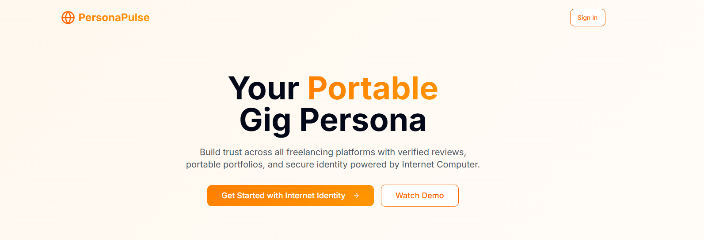
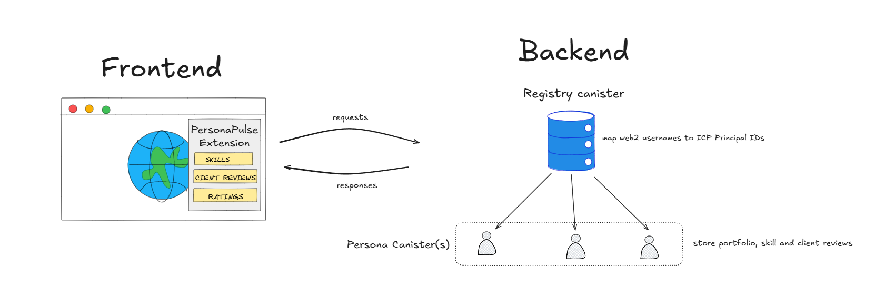

To test project locally, you can use the following commands:

```bash
dfx start --background
dfx deploy
```

Once the job completes, the application will be available at `http://localhost:4943?canisterId={asset_canister_id}`.

The link will also be available on your *terminal*.

# Introduction
### Problem Statement
For many in developing nations, the gig-economy is not a side-hustle but a primary source of livelihood. However, their most valuable asset, their professional reputation is fragmented and trapped within different freelance platforms.

When a freelancer wants to move to a new platform or diversify their client sources, they are forced to start from zero. Years of 5-star ratings, client testimonials, and a proven track record are lost, devaluing their expertise and suppressing their earning potential. This "reputation lock-in" creates a significant barrier to professional mobility and forces skilled workers into a cycle of re-establishing trust, often leading to lower-paying initial contracts.

### Solution
**PersonaPulse**, a portable, tamper-proof digital resume which seamlessly integrates into existing Web2 Freelance platforms.

This portability will be powered by the fact that a freelancer's various gig platform profiles eg Fiveer profile, Upwork profile, will be harmonized to their **Internet Identity**. This will allow their overall reputation to be consolidated and viewed as a whole.

The product demo can be found [here](https://youtu.be/JG4hFc43RrI).

# ICP technologies used

1. Internet Identity V1 (migrating to V2 for smoother UX, allowing users to signup/login with Google)
2. Canister Smart Contracts

# Architecture Design


### Frontend

The frontend consists of two parts

1. **Onboarding website** - this is a ReactJS frontend that allows freelancers to self onboard and upload their previous works and set up a profile. This is the **icp_frontend canister** of this project.
2. **Extension** - this extension will allow clients and employers to view freelancer's portfolios on various gig platforms without them having to leave the website itself. 
The extension will be grabbing gig workers usernames and then querring information from the *registry_backend canister* and *profile_backend canister* so as to display their profile information.
> This feature is on active development

### Backend
1. **registry_backend canister** - it will be matching various user profiles on gig platforms to their internet identity.
2. **profile_backend** - will be housing details of the freelancer's profile. Freelancers will be matched with their internet identities.

## Next steps
- Finish development of the extendion
- Migrate to V2 of Internet Identity when available for smoother UX
- Deploy on mainnet